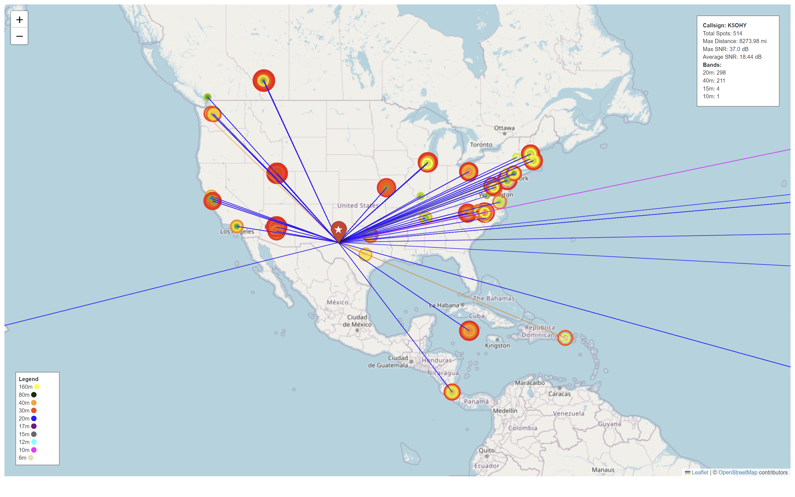

# RBN Signal Mapper

RBN Signal Mapper is a web application designed to visualize Reverse Beacon Network (RBN) data on a map. Users can input a callsign and grid square, and either paste RBN data manually or download it by date. The application generates a map that can be downloaded as an HTML file.

## Features

- Visualize RBN data on a map
- Option to show all reverse beacons
- Download the generated map
- Automatic download of the latest available RBN data if date input is left blank

## Screenshot



## Installation

1. Clone the repository:
   ```bash
   git clone https://github.com/K5OHY/RBN_Map.git
   ```

2. Change to the project directory:
   ```bash
   cd RBN_Map
   ```

3. Create and activate a virtual environment:
   ```bash
   python -m venv venv
   source venv/bin/activate  # On Windows, use `venv\Scripts\activate`
   ```

4. Install the required packages:
   ```bash
   pip install -r requirements.txt
   ```

## Usage

1. Run the application:
   ```bash
   streamlit run app.py
   ```

2. Open your web browser and navigate to `http://localhost:8501`.

3. Follow the instructions on the web page:
   - Enter a callsign and grid square (optional).
   - Select the data source (paste RBN data manually or download by date).
   - Optionally, choose to show all reverse beacons.
   - Click "Generate Map" to visualize the signal map.
   - Download the generated map using the provided download button.

## Requirements

- Python 3.7 or higher
- Streamlit
- Pandas
- Folium
- Matplotlib
- Requests
- Geopy

## License

This project is licensed under the MIT License.

## Acknowledgements

- [Reverse Beacon Network](https://www.reversebeacon.net/)
- [Streamlit](https://www.streamlit.io/)
- [Folium](https://python-visualization.github.io/folium/)
- [Pandas](https://pandas.pydata.org/)
- [Matplotlib](https://matplotlib.org/)
- [Geopy](https://geopy.readthedocs.io/)

## Contributing

Contributions are welcome! Please open an issue or submit a pull request with your improvements.
