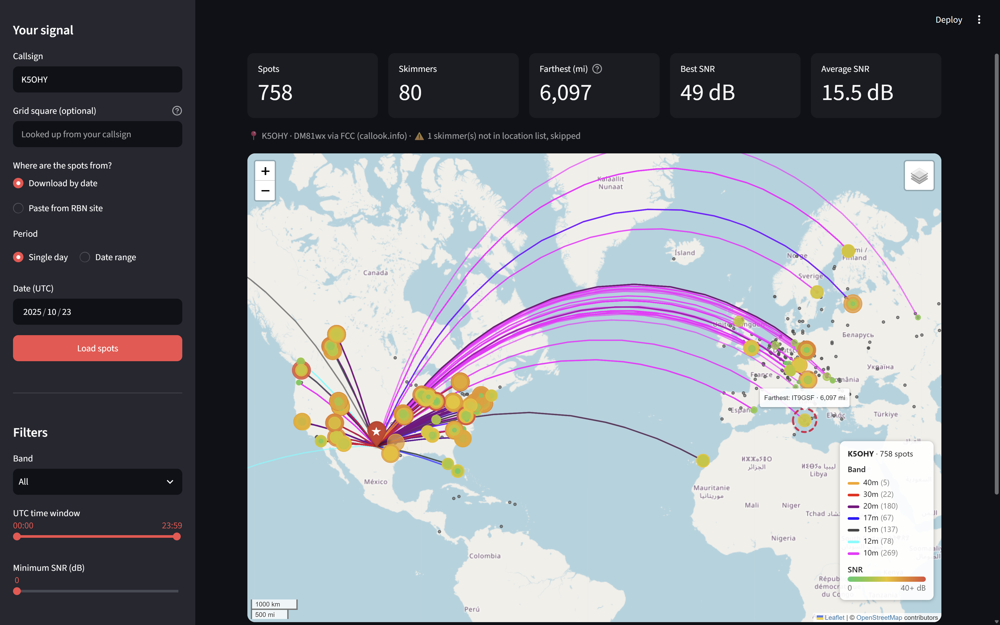

# RBN Signal Mapper

Map the [Reverse Beacon Network](https://www.reversebeacon.net/) stations that spotted your CQ, and how strong your signal was.

Enter a callsign and a date, and the app draws a path from your station to every skimmer that heard you. Spots are coloured by band, and the dots are sized and coloured by SNR.



## Features

- **Automatic location:** the map is centered on your callsign's registered location (RBN skimmer list, then FCC via [callook.info](https://callook.info), then [HamDB](https://hamdb.org), and finally the centre of the callsign's country as an approximate fallback). Type a grid square to override it, for example when operating portable.
- **Always-current skimmer list:** skimmer locations are fetched from reversebeacon.net and refreshed automatically every 24 hours.
- **One day or a date range** (up to 7 days) of RBN history, or paste rows copied from the RBN website.
- **Filters:** band, UTC time window and minimum SNR update the map instantly.
- **Stats:** spot count, skimmers, farthest skimmer (circled on the map), best and average SNR. Miles or kilometres.
- **Map styles:** light, dark, satellite or street. No API keys needed.
- **Download** the map as a standalone HTML file to share.
- Remembers your settings between sessions when run on your own computer.

## Run it locally

You need [Python 3.9+](https://www.python.org/downloads/).

```bash
git clone https://github.com/K5OHY/RBN_Map.git
cd RBN_Map
python -m venv venv
venv\Scripts\activate        # macOS/Linux: source venv/bin/activate
pip install -r requirements.txt
streamlit run web.py
```

Then open http://localhost:8501.

To force a skimmer list refresh: `python rbn_to_csv.py`.

## Files

| File | Purpose |
| --- | --- |
| `web.py` | The Streamlit app (UI, map, stats) |
| `rbn_data.py` | Skimmer list refresh, callsign location lookup, grid-square conversion |
| `spotter_coords.csv` | Cached skimmer locations (auto-updated) |
| `cty.dat` | Country prefix file from [country-files.com](https://www.country-files.com) for the approximate-location fallback (auto-updated monthly) |
| `rbn_to_csv.py` | Command-line shortcut to refresh the skimmer list |

## Data sources and thanks

- [Reverse Beacon Network](https://www.reversebeacon.net/): spots and skimmer locations
- [callook.info](https://callook.info) and [HamDB](https://hamdb.org): callsign locations
- Map tiles: Esri, OpenStreetMap contributors
- Built with [Streamlit](https://streamlit.io/), [Folium](https://python-visualization.github.io/folium/), [pandas](https://pandas.pydata.org/) and [GeographicLib](https://geographiclib.sourceforge.io/)

## License

MIT License.
