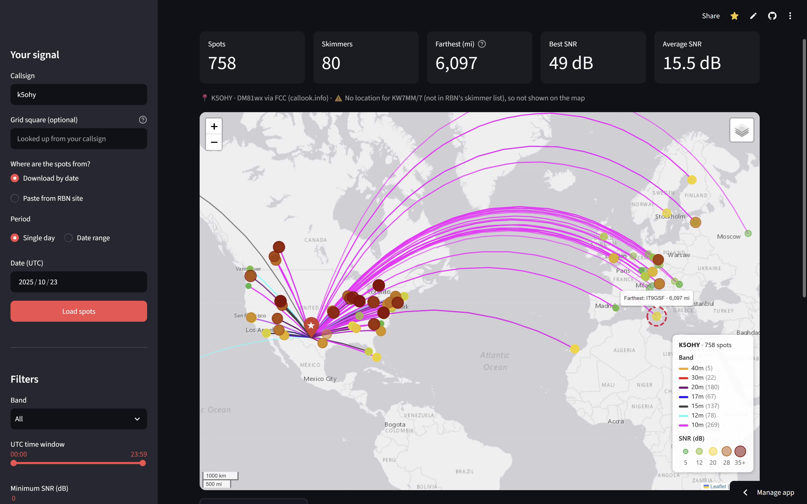

# RBN Signal Mapper

Map the [Reverse Beacon Network](https://www.reversebeacon.net/) stations that spotted your CQ, and see how strong your signal was.

Enter a callsign and load your spots, and the app draws a path from your station to every skimmer that heard you. Paths are coloured by band, and the dots are sized and coloured by SNR. A **compare mode** lines up two frequencies (two antennas, two power levels, two test transmissions) and tells you which one is getting out better.

**Use it online, nothing to install: [rbnmap.streamlit.app](https://rbnmap.streamlit.app/)**



## Contents

- [Quick start](#quick-start)
- [Using the website](#using-the-website)
- [Getting your spots in](#getting-your-spots-in)
- [Features](#features)
- [Compare mode: which antenna is better?](#compare-mode-which-antenna-is-better)
- [Run it locally](#run-it-locally)
- [Troubleshooting](#troubleshooting)
- [Files](#files)
- [Data sources and thanks](#data-sources-and-thanks)

## Quick start

1. Open [rbnmap.streamlit.app](https://rbnmap.streamlit.app/) (or [run it locally](#run-it-locally)).
2. Type your **callsign** in the sidebar.
3. Choose where the spots come from: **Download by date** for a past day, or **Paste from RBN site** for spots from the last few minutes or hours.
4. Click **Load spots**.
5. Use the filters and map settings in the sidebar to explore, and download the map if you want to share it.

## Using the website

The hosted app at [rbnmap.streamlit.app](https://rbnmap.streamlit.app/) is the same app you can run yourself. Everything is in the sidebar on the left, and the results appear on the right.

1. **Callsign.** Your callsign, for example `K5OHY`. The map is centred on your registered location.
2. **Grid square (optional).** Leave it blank to use your callsign's registered address. Enter a 4, 6 or 8 character grid (for example `EM10` or `EM10ci`) if you were portable, or if the lookup could not find you.
3. **Where are the spots from?** See [Getting your spots in](#getting-your-spots-in).
4. **Load spots.** Nothing is fetched until you click this. After that the filters below update the map instantly.
5. **Filters.** Band, UTC time window, and minimum SNR.
6. **Compare mode.** Off by default. See [Compare mode](#compare-mode-which-antenna-is-better).
7. **Map.** Choose a map style, show every skimmer on the map, and switch between miles and kilometres.

Notes for the website:

- Free Streamlit hosting can put an app to sleep when nobody has used it for a while. If you see a message saying so, click the button to wake it up. It can take a short while to start.
- The hosted app does **not** remember your settings between visits, because it is shared. Run it locally if you want your callsign and preferences saved.
- Downloading a whole day of RBN data can take a minute. The progress bar shows what it is doing.

## Getting your spots in

There are two ways to load spots.

### Download by date

Use this for anything up to yesterday (UTC).

- **Single day:** pick a date.
- **Date range:** pick a From and To date, up to 7 days. Each day is a separate download.

The app pulls RBN's daily history file, keeps only spots of your callsign, and throws the rest away. RBN publishes each day's file after the UTC day ends, so **today's spots are not available this way**. If you pick a date with no file yet, the app tells you to try an earlier date.

### Paste from RBN site

Use this for spots from right now, or for anything the daily files do not have yet. This is the way to go for quick antenna tests.

1. Go to [reversebeacon.net](https://www.reversebeacon.net/) and look up the spots for your callsign.
2. Select the spot rows in the table and copy them. It does not matter whether you include the header row.
3. Paste them into the **Paste spot rows here** box in the sidebar.
4. Click **Load spots**.

Each row looks like this once pasted:

```
K1RA-4    K5OHY    DM81wx    1443 mi    14073.0    CW    CQ    7 dB    25 wpm    1908z 26 Sep    94 seconds ago
```

The app reads the fields by what they look like, not by column position, so it also copes with tabs turned into spaces, thousands separators in the distance, and a missing "seen" column. If it cannot read any rows, it shows the first line it could not read.

## Features

### Map

- **Paths from you to every skimmer** that heard you, drawn as great circles (the real shortest route over the globe), so they curve the way radio paths do and do not jump across the edge of the map.
- **Colour by band.** Paths use the same band colours as the RBN website.
- **Dots by SNR.** Each skimmer's dot is sized and coloured by signal strength: small green for weak (about 5 dB), yellow for medium, large dark red for strong (35 dB and above). A legend in the corner shows the scale and how many spots there are per band.
- **Click a dot** to see the skimmer, band, frequency, SNR, time (UTC) and distance.
- **Farthest skimmer** is circled on the map and labelled with its distance.
- **Layers.** The layer button (top right of the map) turns the paths, the spots, and the optional "all skimmers" layer on and off.
- **Show all skimmers** (sidebar) adds a small grey dot for every RBN skimmer, including the ones that did not hear you. Useful for seeing where you were *not* heard.
- **Map style.** Light, dark, satellite or street. No API keys are needed.
- **Distance units.** Miles or kilometres, used everywhere in the app.
- **Download map.** Saves the map as a standalone HTML file that works offline in any browser. Good for sharing.

### Your location

The map pin is placed using the first of these that works:

1. The grid square you typed in the sidebar.
2. The RBN skimmer list, if your callsign is also a skimmer.
3. The FCC database via [callook.info](https://callook.info) (US callsigns).
4. [HamDB](https://hamdb.org) (many other countries).
5. The centre of your callsign's country, as an approximate fallback. The app warns you when it does this, so you can enter a grid for an accurate map.

The pin's popup tells you which source was used.

### Filters

All three update the map instantly, without reloading anything.

- **Band.** All, or one band from 160m to 6m.
- **UTC time window.** Only show spots between two times of day.
- **Minimum SNR.** Hide weak reports.

### Stats

Above the map you get: total spots, number of skimmers, farthest skimmer (with distance), best SNR, and average SNR. If some skimmers are not in the RBN node list, the app lists them and says they cannot be shown on the map.

### Direction of your spots

Below the map, a compass chart splits your spots into 16 directions. Bar length is the number of spots in that direction, and the colour is the average SNR (same colour scale as the map). A summary tells you where you got the most spots and where you were strongest on average. This is handy for seeing what a beam or a vertical really does.

### Spot table

Expand **Spot table** at the bottom to see every spot as a sortable table.

### Always-current skimmer list

Skimmer locations come straight from reversebeacon.net and are refreshed automatically once every 24 hours. Skimmers that later drop off RBN's list are kept, so old history files still plot correctly.

### Remembers your settings (locally)

When you run it on your own computer, the app saves your callsign, grid, band, map style and other choices in `settings.json` and restores them next time. This is switched off on the shared website.

## Compare mode: which antenna is better?

Compare mode is for A/B tests: send on one frequency, change the antenna (or power, or anything else) and frequency, then send again. Reverse Beacon Network skimmers report both, and the app lines them up.

### How to run a test

1. Call CQ on frequency **A** for a few minutes.
2. Change to frequency **B** (a few kHz away is fine) with the other antenna, and call CQ for a few minutes.
3. Copy the spot rows from the RBN website and **paste** them in (see [Paste from RBN site](#paste-from-rbn-site)). This works for spots from the last few minutes, so you do not have to wait for the daily file.
4. Tick **Compare two frequencies** in the sidebar and click **Load spots**.

Tips for a fair test:

- Keep the two tests **close together in time**. Propagation drifts, so a gap of an hour or more can make one frequency look better for reasons that have nothing to do with the antenna.
- Give each frequency a few minutes, so plenty of skimmers hear it.
- Use the same power and the same speed for both.

### Picking the two frequencies

Compare mode splits your spots into groups of nearby frequencies. Skimmers report slightly different frequencies for the same signal, so spots closer together than the **Frequency gap** (default 0.5 kHz) are treated as one frequency.

- The two biggest groups are chosen for you as **A** and **B**. Change them with the two dropdowns, which show each group's frequency, number of spots and time span.
- If two of your tests were merged into one group, lower the **Frequency gap** in the sidebar. If one test was split in two, raise it.

### Reading the results

The **Results** tab shows:

1. **The answer in one line.** For example: "A (14071.9 kHz) is getting out better: it reached more skimmers and had the stronger signal." If the two split (one reached more skimmers, the other was stronger), it says "Mixed result". If neither is clearly ahead, it says "Too close to call".
2. **A scoreboard** with A and B side by side. The winner of each row is highlighted:
   - **Skimmers that heard you.** More is better. Under each number is how many skimmers heard *only* that frequency.
   - **Average SNR.** This compares only the skimmers that heard **both** frequencies, so it is a like-for-like comparison. A frequency only wins if its lead is bigger than random variation would explain (a 95% confidence check). Otherwise the row is a tie.
   - **Strongest direction.** The compass direction where each frequency's signal was best.
3. **Direction.** A compass chart with both frequencies overlaid, blue for A and orange for B. Distance from the centre is the average SNR toward that direction, so a bigger shape in a direction means a stronger signal that way. Next to it, the app lists the directions where A is stronger, where B is stronger (by at least 2 dB), and any directions only one of them reached.
4. **Same skimmer, both frequencies.** A table of every skimmer that heard both, with its distance, A's SNR, B's SNR, the difference, and which was stronger (the stronger SNR is tinted). Click a column heading to sort, for example by difference to see where one side wins by the most. Each SNR is the median of that skimmer's spots, so a single odd report does not skew a row.

The **Side-by-side maps** tab shows the map for A next to the map for B. Both use the same view, the same SNR colours and the same dot sizes, so they are directly comparable. Each map has its own download button.

Compare mode works with either source (download or paste), and the sidebar filters (band, time window, minimum SNR) apply before the frequencies are split.

## Run it locally

You need [Python 3.9+](https://www.python.org/downloads/) and about a minute.

### Windows (PowerShell or Windows Terminal)

Set it up once:

```bash
git clone https://github.com/K5OHY/RBN_Map.git
cd RBN_Map
python -m venv .venv
.venv\Scripts\python -m pip install -r requirements.txt
```

Then start the app, from the project folder:

```bash
.venv\Scripts\streamlit run web.py
```

Use exactly that command. Typing plain `streamlit run web.py` fails with "streamlit is not recognized", because the packages are installed inside `.venv` and Windows does not know where to find them unless the environment is activated. Calling `.venv\Scripts\streamlit` directly means you never have to activate anything.

If `python` is not found, try `py -m venv .venv` instead.

### macOS / Linux

```bash
git clone https://github.com/K5OHY/RBN_Map.git
cd RBN_Map
python3 -m venv .venv
.venv/bin/python -m pip install -r requirements.txt
.venv/bin/streamlit run web.py
```

### Every time after that

Open a terminal in the project folder and run the last command again (`.venv\Scripts\streamlit run web.py` on Windows, `.venv/bin/streamlit run web.py` on macOS/Linux).

Streamlit prints a local address and usually opens your browser. If it does not, open http://localhost:8501. Stop the app with Ctrl+C in the terminal.

### Updating the skimmer list by hand

The app refreshes the skimmer list on its own every 24 hours. To force it right now:

```bash
.venv\Scripts\python rbn_to_csv.py
```

(On macOS/Linux: `.venv/bin/python rbn_to_csv.py`.)

## Troubleshooting

| What you see | What it means and what to do |
| --- | --- |
| "RBN has no data file for ... yet" | RBN publishes a day's file after the UTC day ends. Pick an earlier date, or use **Paste from RBN site** for today's spots. |
| "RBN has no spots of ... for that date" | Check the callsign, or try another day. If you pasted rows, make sure they are spots of your callsign. |
| "Couldn't read any spot rows from the pasted text" | The pasted text is not in the RBN spot table format. The message quotes the first line it could not read. Copy the rows straight from the RBN spot table. |
| "Couldn't find a location for ..." | Enter your grid square in the sidebar. |
| A warning that the pin is at the centre of a country | The lookups found nothing more precise. Enter your grid square for an accurate map. |
| "No location for ..." under the stats | Those skimmers are not in the RBN node list, so they are counted but not drawn on the map. |
| Compare mode says it found only one frequency group | Your spots are on one frequency, or the **Frequency gap** is too wide and merged your tests. Lower the gap in the sidebar. |
| Compare mode says no skimmer heard both frequencies | There is nothing to compare like for like. Compare the skimmer counts and directions instead, or try again with longer tests. |
| Downloading is slow | A day of RBN data is a large file, and each day in a range is a separate download. Results are cached for an hour. |

## Files

| File | Purpose |
| --- | --- |
| `web.py` | The Streamlit app: interface, maps, stats, compare mode |
| `rbn_data.py` | Skimmer list refresh, callsign location lookup, grid-square conversion |
| `spotter_coords.csv` | Cached skimmer locations (updated automatically) |
| `cty.dat` | Country prefix file from [country-files.com](https://www.country-files.com), used for the approximate-location fallback (updated monthly) |
| `rbn_to_csv.py` | Command-line shortcut to refresh the skimmer list now |
| `Update_spotters.py` | Older helper: converts an RBN node table you paste into the script into `updated_spotter_coords.csv`. Not needed for normal use. |
| `requirements.txt` | Python packages to install |
| `settings.json` | Your saved settings (created locally, never committed) |
| `images/` | Screenshot used by this README |

## Data sources and thanks

- [Reverse Beacon Network](https://www.reversebeacon.net/): spots and skimmer locations
- [callook.info](https://callook.info) and [HamDB](https://hamdb.org): callsign locations
- [country-files.com](https://www.country-files.com): country prefixes
- Map tiles: Esri, OpenStreetMap contributors
- Built with [Streamlit](https://streamlit.io/), [Folium](https://python-visualization.github.io/folium/), [pandas](https://pandas.pydata.org/), [Matplotlib](https://matplotlib.org/) and [GeographicLib](https://geographiclib.sourceforge.io/)

## License

MIT License.
